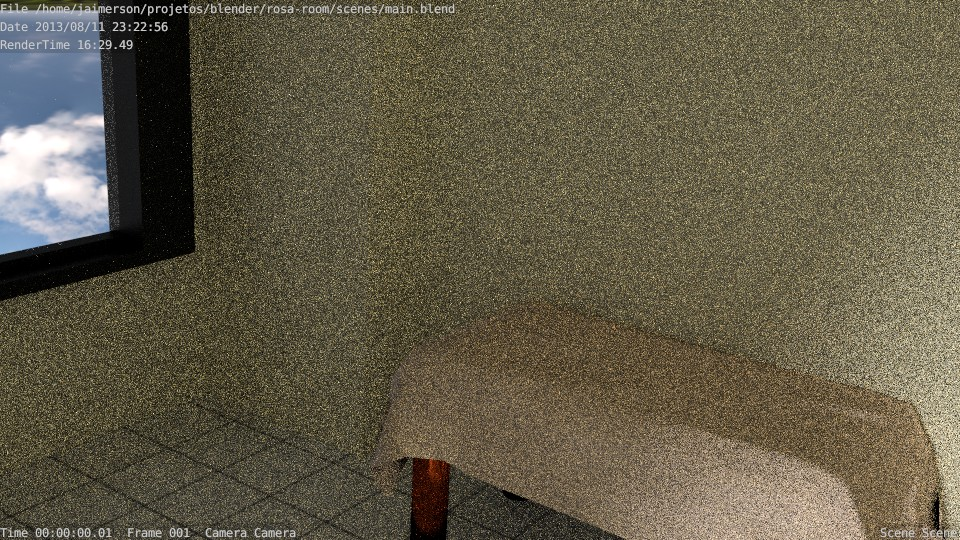

Rosa's room
=============

This project was made using Blender 2.68 and rendered in Cycles.

Here's the first render, made in a hurry:

Now after some work, and a more complete render:

(the bed isn't supposed to look like a wall)

###### Bonus:
Panoramic test :)

